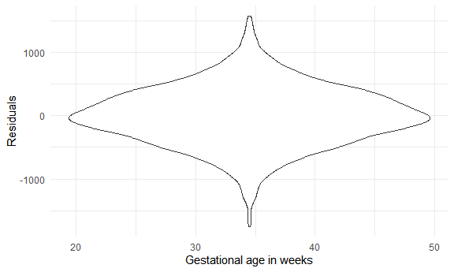

p8105\_hw6\_ms5965
================

## Problem 1

``` r
homicide_df = 
  read_csv("data/homicide_data.csv", na = c("", "NA", "Unknown")) %>% 
  mutate(
    city_state = str_c(city, state, sep = ", "),
    victim_age = as.numeric(victim_age),
    resolution = case_when(
      disposition == "Closed without arrest" ~ 0,
      disposition == "Open/No arrest"        ~ 0,
      disposition == "Closed by arrest"      ~ 1)
  ) %>% 
  filter(
    victim_race %in% c("White", "Black"),
    city_state != "Tulsa, AL") %>% 
  select(city_state, resolution, victim_age, victim_race, victim_sex)
```

    ## Parsed with column specification:
    ## cols(
    ##   uid = col_character(),
    ##   reported_date = col_double(),
    ##   victim_last = col_character(),
    ##   victim_first = col_character(),
    ##   victim_race = col_character(),
    ##   victim_age = col_double(),
    ##   victim_sex = col_character(),
    ##   city = col_character(),
    ##   state = col_character(),
    ##   lat = col_double(),
    ##   lon = col_double(),
    ##   disposition = col_character()
    ## )

Baltimore, MD

``` r
baltimore_df =
  homicide_df %>% 
  filter(city_state == "Baltimore, MD")
glm(resolution ~ victim_age + victim_race + victim_sex, 
    data = baltimore_df,
    family = binomial()) %>% 
  broom::tidy() %>% 
  mutate(
    OR = exp(estimate),
    CI_lower = exp(estimate - 1.96 * std.error),
    CI_upper = exp(estimate + 1.96 * std.error)
  ) %>% 
  select(term, OR, starts_with("CI")) %>% 
  knitr::kable(digits = 3)
```

| term              |    OR | CI\_lower | CI\_upper |
| :---------------- | ----: | --------: | --------: |
| (Intercept)       | 1.363 |     0.975 |     1.907 |
| victim\_age       | 0.993 |     0.987 |     1.000 |
| victim\_raceWhite | 2.320 |     1.648 |     3.268 |
| victim\_sexMale   | 0.426 |     0.325 |     0.558 |

All cities:

``` r
models_results_df = 
  homicide_df %>% 
  nest(data = -city_state) %>% 
  mutate(
    models = 
      map(.x = data, ~glm(resolution ~ victim_age + victim_race + victim_sex, data = .x, family = binomial())),
    results = map(models, broom::tidy)
  ) %>% 
  select(city_state, results) %>% 
  unnest(results) %>% 
  mutate(
    OR = exp(estimate),
    CI_lower = exp(estimate - 1.96 * std.error),
    CI_upper = exp(estimate + 1.96 * std.error)
  ) %>% 
  select(city_state, term, OR, starts_with("CI")) 
```

``` r
models_results_df %>% 
  filter(term == "victim_sexMale") %>% 
  mutate(city_state = fct_reorder(city_state, OR)) %>% 
  ggplot(aes(x = city_state, y = OR)) + 
  geom_point() + 
  geom_errorbar(aes(ymin = CI_lower, ymax = CI_upper)) + 
  theme(axis.text.x = element_text(angle = 90, hjust = 1))
```


## Problem 2

``` r
bw_df = 
  read_csv("data/birthweight.csv", na = c("", "NA", "Unknown")) %>% 
  janitor::clean_names() %>% 
  mutate(
    babysex = as.factor(babysex), 
    frace = as.factor(frace),
    mrace = as.factor(mrace),
    malform = as.factor(malform),
    parity = as.factor(parity),
    pnumlbw = as.factor(pnumlbw),
    pnumsga = as.factor(pnumsga)
  )
```

    ## Parsed with column specification:
    ## cols(
    ##   .default = col_double()
    ## )

    ## See spec(...) for full column specifications.

``` r
bw_model_1 = lm(bwt ~ gaweeks + smoken, data = bw_df, na.action = na.exclude) 
```

``` r
bw_df %>% 
  modelr::add_residuals(bw_model_1) %>%
  modelr::add_predictions(bw_model_1) %>% 
  ggplot(aes(x = gaweeks, y = resid)) + 
  geom_violin() +
  labs(
    x = "Gestational age in weeks",
    y = "Residuals"
  )
```



Baby’s birth weight was modeled against gestational age in weeks and
mother’s smoking habits in a linear regression model. Smoking can act as
a confounder given that it can result in preterm births, hence, lower
gestational age. It can also impact birth outcomes i.e. birth weight.
Residuals were analyzed to identify issues in model fit.

Models 2 & 3:

``` r
bw_model_2 = lm(bwt ~ gaweeks + blength, data = bw_df, na.action = na.exclude) 

bw_model_3 = lm(bwt ~ bhead*babysex*blength, data = bw_df, na.action = na.exclude) 
```

``` r
bw_df %>% 
  gather_predictions(bw_model_1, bw_model_2, bw_model_3) %>% 
  mutate(model = fct_inorder(model)) %>% 
  ggplot(aes(x = gaweeks, y = bwt)) + 
  geom_point(alpha = 0.5) + 
  geom_smooth(aes(y = pred), color = "red") + 
  facet_grid(~model)
```

    ## `geom_smooth()` using method = 'gam' and formula 'y ~ s(x, bs = "cs")'


``` r
set.seed(1)

cv_df = 
  crossv_mc(bw_df, 100) %>% 
  mutate(
    train = map(train, as_tibble),
    test = map(test, as_tibble)) %>% 
  mutate(
    bw_model_1 = map(train, ~ lm(bwt ~ gaweeks + smoken, na.action = na.exclude, data = .x)),
    bw_model_2 = map(train, ~ lm(bwt ~ gaweeks + blength, na.action = na.exclude, data = .x)),
    bw_model_3 = map(train, ~ lm(bwt ~ bhead*babysex*blength, na.action = na.exclude, data = .x))
    ) %>%   
  mutate(
    rmse_model1 = map2_dbl(bw_model_1, test, ~rmse(model = .x, data = .y)),
    rmse_model2 = map2_dbl(bw_model_2, test, ~rmse(model = .x, data = .y)),
    rmse_model3 = map2_dbl(bw_model_3, test, ~rmse(model = .x, data = .y))) %>% 
    select(starts_with("rmse")) %>% 
  pivot_longer(
    everything(),
    names_to = "model", 
    values_to = "rmse",
    names_prefix = "rmse_") %>% 
  mutate(model = fct_inorder(model)) %>% 
  ggplot(aes(x = model, y = rmse, color = model)) + geom_violin()
  
cv_df
```


## Problem 3

``` r
weather_df = 
  rnoaa::meteo_pull_monitors(
    c("USW00094728"),
    var = c("PRCP", "TMIN", "TMAX"), 
    date_min = "2017-01-01",
    date_max = "2017-12-31") %>%
  mutate(
    name = recode(id, USW00094728 = "CentralPark_NY"),
    tmin = tmin / 10,
    tmax = tmax / 10) %>%
  select(name, id, everything())
```

    ## Registered S3 method overwritten by 'hoardr':
    ##   method           from
    ##   print.cache_info httr

    ## using cached file: C:\Users\mehrs\AppData\Local\cache/R/noaa_ghcnd/USW00094728.dly

    ## date created (size, mb): 2020-10-07 23:59:17 (7.54)

    ## file min/max dates: 1869-01-01 / 2020-10-31

``` r
boot_sample = function(df) {
  sample_frac(df, replace = TRUE)
}
```

``` r
boot_straps = 
  data_frame(
    strap_number = 1:5000,
    strap_sample = rerun(5000, boot_sample(weather_df))
  )
```

    ## Warning: `data_frame()` is deprecated as of tibble 1.1.0.
    ## Please use `tibble()` instead.
    ## This warning is displayed once every 8 hours.
    ## Call `lifecycle::last_warnings()` to see where this warning was generated.

``` r
bootstrap_results = 
  boot_straps %>% 
  mutate(
    models = map(strap_sample, ~lm(tmax ~ tmin, data = .x)),
    results = map(models, broom::tidy),  
    r2 = map(models, broom::glance)) %>% 
  select(-strap_sample, -models) %>% 
  unnest(r2) %>% 
  mutate(
    r_squared = r.squared,
    r2_0.025 = quantile(r.squared, 0.025),
    r2_0.975 = quantile(r.squared, 0.975)
  ) %>% 
  select(-p.value, -statistic) %>% 
  unnest(results) %>% 
  mutate(
    log_estimate = log(estimate),
    est_0.25 = quantile(log_estimate, 0.025),
    est_0.25 = quantile(log_estimate, 0.975)
  ) %>% 
  ggplot(aes(x = log_estimate)) + geom_density()
```

The distribution of the estimates in an inverted parabola.

``` r
bootstrap_results_1 = 
  boot_straps %>% 
  mutate(
    models = map(strap_sample, ~lm(tmax ~ tmin, data = .x)),
    results = map(models, broom::tidy),  
    r2 = map(models, broom::glance)) %>% 
  select(-strap_sample, -models) %>% 
  unnest(r2) %>% 
  mutate(
    r_squared = r.squared,
    r2_0.025 = quantile(r.squared, 0.025),
    r2_0.975 = quantile(r.squared, 0.975)
  ) %>% 
  select(-p.value, -statistic) %>% 
  unnest(results) %>% 
  mutate(
    log_estimate = log(estimate),
    est_0.25 = quantile(log_estimate, 0.025),
    est_0.25 = quantile(log_estimate, 0.975)
  ) %>% 
  ggplot(aes(x = r_squared)) + geom_density()
```

The distribution of r-squares is almost normally distributed with a
small bulge on the left.
